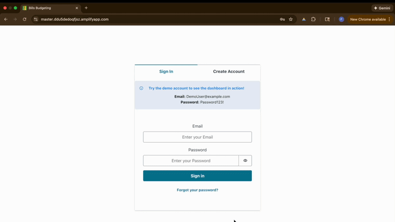
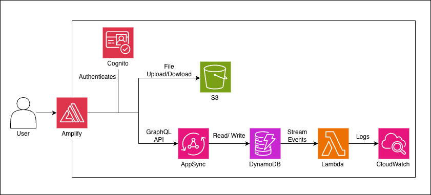

# Bills Budgeting

Bills Budgeting is a full-stack personal finance app built with modern AWS infrastructure. Track income and expenses, upload file attachments, get real-time updates, and see detailed analytics on spending patterns. Try the deployed site below.

## [#Click me to try the app yourself](https://master.ddu5dedoqfjsz.amplifyapp.com/)

## Demo Account

Test the app without creating an account:

- **Email:** DemoUser@example.com
- **Password:** Password123!

This account is read-only and pre-populated with sample transactions.



## Architecture



## About This Project

I built Bills Budgeting to deep-dive into full-stack development with AWS infrastructure. 
Specifically, I wanted hands-on experience with:

- **AWS Services** - Practical experience with DynamoDB, S3, Lambda, CloudWatch, Cognito and AppSync
- **Infrastructure-as-Code** - Using Amplify Gen 2 to orchestrate backend resources in TypeScript 
- **Authentication & Authorization** - Implementing Cognito user pools and owner-based data 
  access rules
- **Real-time data synchronization** - Understanding how AppSync subscriptions work and 
  managing data state across multiple users


Beyond the tech, I wanted to build something **complete and deployable**—not just a local 
project. This meant learning deployment workflows, handling edge cases, and debugging issues 
in production.

## Features

- **Transaction Management** - Create, update, and delete income and expense entries with real-time sync
- **File Attachments** - Upload receipts and documents to transactions, stored securely in S3
- **Real-Time Updates** - Changes appear instantly via AppSync subscriptions—no page refresh needed
- **Analytics Dashboard** - Track income vs expenses with visual charts and customizable date filters
- **Export Data** - Download filtered transactions as CSV for external analysis
- **Read-Only Demo** - See how it works with pre-populated sample data without affecting your account

## Tech Stack

**Frontend:**
- React 18 + TypeScript
- Mantine UI
- AWS Amplify Client Library
- Vite

**Backend (AWS):**
- Amplify Gen 2
- AppSync
- Cognito
- DynamoDB
- S3
- Lambda

## Technical Challenges

### Race Condition: Hook Before Auth
`useTransactions` was calling `observeQuery()` before authentication completed, causing AWS to reject requests since there was no "owner" token yet. 

I fixed this by ensuring `useTransactions` only initializes after the `Authenticator` verifies the user's login status. This reinforced the importance of explicitly sequencing component initialization with authentication state.

### Circular Dependency in CloudFormation
Lambda, DynamoDB, and S3 created a circular dependency during deployment because Lambda referenced the S3 bucket, which depended on the data stack, which included Lambda. 

I resolved this by removing S3 access from Lambda and instead handling file cleanup in the frontend before deleting transactions. This taught me that simpler solutions that avoid tight coupling are better.

### Auth State Management with Real-Time Subscriptions
When users signed out and signed in as a different account, the old user's transactions persisted until page refresh. The AppSync subscription wasn't re-initializing when auth state changed because the effect dependency array wasn't triggering re-runs. 

I solved this by using Amplify Hub to listen for `signedIn`/`signedOut` events and manually re-initialize the data subscription. This taught me that real-time systems require explicit lifecycle management—auth state changes don't automatically cascade to subscriptions.

## Next Features

- **Bank Account Integration** - Connect to Plaid or Stripe to auto-import transactions, eliminating manual data entry
- **Smart Receipt Analysis** - Use AWS Textract or Claude API to automatically extract amounts and descriptions from uploaded documents
- **Budget Alerts** - Set monthly spending limits per category and receive notifications when approaching budget
- **Monthly Reports** - Generate and email spending summaries with trends and insights
- **Recurring Transactions** - Auto-create repeat transactions (rent, subscriptions, etc.) to save time

## Run Locally

1. Clone the repo: `git clone https://github.com/paul-io/bills-budgeting.git`
2. Install dependencies: `npm install`
3. Start sandbox: `npx @aws-amplify/backend-cli sandbox`
4. In another terminal: `npm run dev`
5. Open http://localhost:5173

The sandbox creates an isolated backend environment tied to your AWS account. You'll need:
- An AWS account
- AWS CLI configured with credentials
- Node.js 18+

## Deployment

Uses Amplify's pipeline deployment for production:

```bash
npx ampx pipeline-deploy --branch main
```

This project uses Amplify's CI/CD pipeline. Connect your GitHub repo in the AWS Console. Every push to the selected branch triggers deployment to frontend and backend.

## Project Structure

```
src/
├── components/
│   ├── dashboard/       # Summary cards, charts
│   ├── transactions/    # CRUD interface, filters, table
│   ├── layout/          # App shell, header, nav
│   └── shared/          # Reusable components
├── hooks/
│   ├── useTransactions.ts       # CRUD operations, CSV export
│   └── useTransactionFilters.ts # Sorting, filtering, search
└── utils/
    ├── types.ts         # TypeScript definitions
    ├── constants.ts     # App-wide constants
    └── formatters.ts    # Date/currency formatting

amplify/
├── auth/         # Cognito configuration
├── data/         # GraphQL schema, DynamoDB setup
├── storage/      # S3 bucket configuration
└── functions/    # Lambda handlers
```

## License

MIT

---

Built by Paul Ioffreda • [GitHub](https://github.com/paul-io)